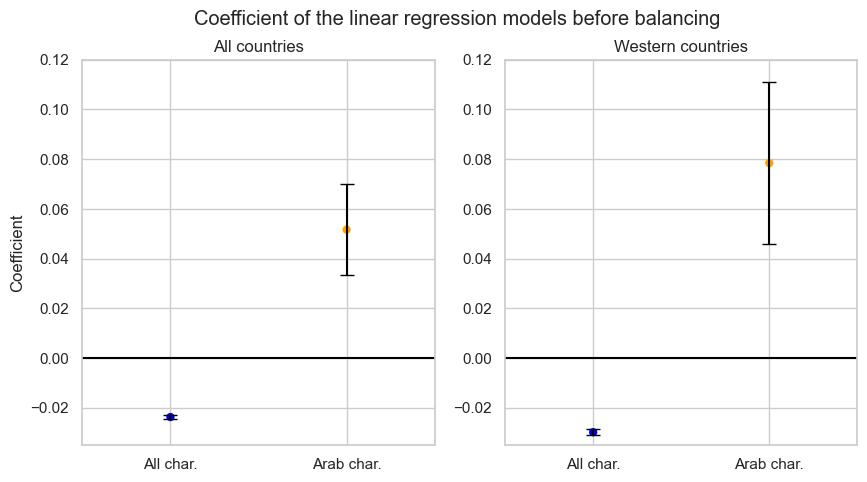

In the realm of cinema, the silver screen not only reflects our collective imagination but also mirrors the complex tapestry of societal changes and historical events. One such moment that reverberated globally was the tragic day of September 11, 2001. Beyond its immediate and profound impact on geopolitics, security measures, and the psyche of nations, the events of 9/11 had a far-reaching influence on the cultural landscape, including the portrayal of Arab identities in the movies.

Our data analysis journey delves into the intersection of reality and reel, seeking to understand how one of the most significant events of the 21st century shaped the representation of Arabs in cinema. The lens through which movies depict Arab characters, cultures, and narratives has often been subject to scrutiny, with questions raised about the perpetuation of stereotypes and the impact of real-world events on cinematic storytelling.

Through our analysis of the CMU movie dataset, spanning pre and post-9/11 eras, we hope to unearth patterns, trends, and anomalies that illuminate the relationship between historical events and cinematic narratives. As we unravel the *reel impact of real-world events* (*tu-dums*), our journey promises to uncover not only the challenges but also the opportunities for more authentic storytelling in the world of cinema. So, grab your popcorn, and... *Lights... Camera... Action!*

*For more details about the dataset (CMU movie summary corpus), [click this link](https://alexei-erm.github.io/thedataset)*

## Wait a second... How do we detect Arab characters?

Indeed, an important stepping stone for the analysis is to have a consensus on what we mean by "Arab" character or location. It is not an easy game to play. First of all, "Arab people" is a broad concept. It refers to an ethnolinguistic group sharing a common Arabic heritage, culture, and language, primarily found in the Middle East and North Africa. Distinguishing Arab identity is challenging due to the diversity within the Arab world, embracing various ethnicities, customs, and physical traits. Historical migrations, intercultural mixing, fluid identity based on language and culture, overlapping with other identities, and political influences further complicate a precise definition. Arab identity is complex and is based on shared linguistic and cultural affiliations rather than rigid genetic or racial criteria. 

Our goal is to identify those Arabs that clearly distinguish themselves inside the movie plot summaries, predilecting accuracy to the number of characters detected in the plot. To do so, we found a [list of Arab given names and some common variants on Wikipedia](https://en.wikipedia.org/wiki/List_of_Arabic_given_names).

This list still needs some work. In fact, there is the risk of identifying characters inside the plots as Arabic even though they are not, as the list is comprehensive of names that could be present not only in Arab culture. We thus used a language model (chatGPT) to "clean" the list by eliminating possible names that are not mainly Arab.

To identify names, two different paths have been followed, respectively for the first and the second part of the study.
- Compare the list of characters contained in the dataset `character.metadata.tsv` with the list of Arab names;
- Perform NER (Named Entity Recognition) and then compare entities in the plots identified as "PERSON" with the list of Arab names.
In the first case we choose the characters we have metadata about (needed for the observational study), while in the second case, we identify characters inside the movie plots (to perform sentiment analysis).

In particular, to verify the quality of this second methodology, we asked a large language model (chatGPT) to identify Arab characters in a subset of 50 randomly chosen movie plots. We then compared the names extracted by chatGPT and the ones resulting from our methodology. The result was as expected: chatGPT detected many more Arab characters than us, which is justified considering that it can detect names that are not present in the list but are considered arabs for the context they are in. Note that NER understands the context for the identification of entities, but our methodology does not allow us to say if a name is arab based on the context.
 The important result is that in only 3/50 cases our model detects an Arab character and chatGPT does not. This is the most dangerous situation which could occur, as we would be treating a non-Arab character as Arab, making our analysis inexact. This phenomenon is very restricted. Here are shown the first 5 examples resulting from the validation
 
| movie_name                     | arab_names_in_plots_chatGPT                             | our_results      |
|---------------------------------|--------------------------------------------------------|-------------------|
| Mike Bassett: England Manager   | [Lonnie Urquart, Bashir]                                | [Bashir]          |
| Rog                             | [Uday Singh Rathod, Maya Solomon, Harsh, Ali, Shyamoli] | [Ali]             |
| Be Cool                         | []                                                     | [Raji]            |
| Sabah                           | [Sabah, Majid, Souhaire]                                | [Majid, Sabah]    |
| Khuda Ke Liye                   | [Mansoor, Sarmad, Mary/Mariam, Dave, Maulana]           | [Sarmad]          |

## Wait another second... Which year range should we use?
The selected years for the study need to have a consistent representation of Arabs before and after 2001 and exclude other non-negligible real-world events. We thus limit the analysis to movies from 1972 to 2012. We know that there are still historical events that could have changed the Arab representation, as the Gulf war in 1990. Still, we think this is a good compromise between the number of films analysed and the other _noisy_ previous historical events. Speaking about events after 2001, we can say that a lot of them were triggered by the 9/11 attack, the so-called ["War on Terror"](https://www.history.com/topics/21st-century/war-on-terror-timeline) announced by President Bush, that led to Afghanistan and Iraq wars.

## Uhhh, last definition... what do we mean by a "western" country?
We define a Western country as the United States, Canada, and the countries exclusively part of [Continental Europe](https://en.wikipedia.org/wiki/Europe). We are excluding, for instance, Russia and Turkey which are also in Asia. The reason for this choice was to analyse a subset of countries that are culturally similar and reacted to 9/11 in a comparable way. We could have chosen also to select only the USA, but this generated a too small subset to be studied.

# The "War and Crime" genre

One initial question we can explore is how the participation of Arab characters in the War and Crime (W&C) genre changed after 2001, if at all. Is this effect more evident in the western countries? This analysis can be made without the use of a movie's plot so it is a great place to start at. Here, we detect Arab characters in our dataset directly from the character metadata. In addition, we define War and Crime as the sum of `'Crime Fiction'`  and  `'War film'` genres, using that as an index of participation in violent and belligerent contents. Let's see if some trends can be spotted by plotting simple statistics at first, regarding all character and Arab character participation in W&C movies!

- Considering all the characters (blue bars), we can see that there is no clear trend. After 2003 the value seems eventually to decrease, which means a decreasing participation for characters in W&C movies.

- The trend for Arab characters (orange bar) shows significant fluctuations over the years, particularly evident in the last century. This is due to the small participation in W&C (less than 5 per year before 2003), generating less reliable values. There is a local increase between 2002 and 2006, and after 2004 Arab characters seem to play a higher fraction of these genre films than the overall characters in terms of mean values. Still, the uncertainty given by bootstrapping shows that this can be stated only for the years 2006, 2011, and 2012, where the confidence intervals do not intersect.

In parallel, we filter for films published in Western countries, to understand if there is a more evident effect:

The Western country's time evolution is similar with respect to all countries' case. Accounting for all characters, we notice again a stagnant trend with a decrease after 2003. Arabs show a more evident lack of data before 2000 with a large confidence interval. Still, we can see the local increase in the years range 2002-2006.

To be more precise in this analysis, we look at the features before and after 2001. This grouping is done to avoid the problem of sparsity of data for Arabs, especially during the last century movies, that leads to high uncertainty.
We also want to check that a possible increase in Arab roles, a subset of the roles, is not due to the overall increase in character participation in W&C movies. 

Taking as predictor the binary variable of being in a movie after 2001 and as outcome the participation in a W&C movie (also binary) we can fit a linear regression. Following what is explained in the yearly evolution, we study the trends for all characters and Arab characters both for all countries and western countries. The models give significant results in all the cases.
We see a negative coefficient looking at the characters in general (blue dots) in both geographical scenarios. It means a decrease in participation in W&C movies compared to the ones published before and after 9/11. On the contrary, Arabs show a positive correlation (orange dots), but we cannot say that the one for Western countries is higher since the error bars intersect.  

A correlation does not reflect causality, since we are not considering the action of confounders. To investigate the causal link, we use an observational study scheme, with the treatment as the publication after 2001 and the outcome as the fraction of Arab characters in W&C movies. This is done for both the whole world and the western countries, generating two studies.
Also, to say that the trend for Arabs is not due to a general increase of all characters in W&C movies, we should set another observational study and compare the output coefficients. This is out of the scope of our analysis, which uses the results shown before as the first proof of this.

### Observational study on W&C movies

Are we ready for some causal diagrams and confounding factors? As mentioned, here we go with 2 sweet observational studies! Whereas for the _first_ we use all the countries of publication, for the _second_ we filter for the Western countries. 
We have the following treatment (**T**) and outcome (**O**)
- **T** Arab character participates in a film released after 2001
- **O** Movie belongs to a w&c genre

First, we need to discuss the causal analysis's confounders (**C**). We treat the following features:
- **C1** Geographical zone of the movie publication
    - effect on the treatment: The cinema industry can be more or less active in a country depending on cultural and economic effects that may change over the years. E.g. boom of the Indian industry after 2000
    - effect on the outcome: different countries have different cultures, so different incidences of a certain genre. e.g. a W&C film with Arab characters could be published more probably in the US
- **C2** Sex of the actor: 
    - effect on the treatment: Arab females could be obstructed from being actresses for religious rules that were stricter in the past, so there could be fewer female Arab characters in the past 
    - effect on the outcome: male characters could be used more frequently in W&C films
- **C3** Age of the actor at release 
    - effect on the treatment: during the film history, it is possible that certain legal/cultural rules obstructed the presence of young actors
    - effect on the outcome: young characters and therefore actors could have a role more frequently in W&C films

The information on sex and age is simply obtainable from `character.metadata.tsv`. For the region, we used the information on publication countries from `movie.metadata.tsv` grouping the countries following the [United Nations](https://ourworldindata.org/world-region-map-definitions) map: 

For the second observational study **C1** is not a possible confounder since all the Western countries, where we hypothesize that the cultural influence is similar, are included in the region "Europe and North America".
Two schemes sum up the hypothesized causal links stated before:

To eliminate the observed covariates, we use them as regressors in the propensity score matching, through a logistic regression model. Before this, the continuous variable (actor age) is standardised, whereas the categorical are converted into dummy indicators. Then, the score, measuring the probability of being treated, is computed and added to the population data frame. A biparted graph is created between treated (film published after 2001) and control (before 2001) subsets, matching the couples optimising for similar propensity scores. We obtained 345 and 140 matched pairs for the first and second studies, which are the base for our analysis.  
We should remember that the data could still be biased since there are unmeasurable features that could still influence both the treatment and the outcome. These are called "unobserved covariates" and are not balanced in the control and treatment groups. Examples are the quality of the movie, the director's taste, and interregional cultural and economic differences.

### What did we find? 
After balancing, we use the linear regression model, as done before the observational study, to understand if there is still a positive correlation between being an Arab character in a movie after 2001 and participating in a W&C movie:

The results give support to the existence of a causal link, not confounded by the observed variables. Both models give positive coefficients with a significant p-value, with a 6% (all countries) and 12% (western countries) increase in probability for Arabs' participation in W&C movies. We can state that this correlation intensifies when accounting only for Western countries, in fact the two confidence intervals, made with standard deviation, do not intersect. This intuitively makes sense since these countries were the ones where 9/11 had the biggest cultural impact. This result does not consider the possible positive or negative connotations in the movies. In the following parts, we delve into this more nuanced analysis.

# Topic Modeling 

In the "Topic Modeling » section, we try to  present a comprehensive exploration into the portrayal of Arabic characters in Western movies, spanning the years 1972 to 2013. The analysis filters and categorizes movies based on the inclusion of Arabic characters. The study then divides the movies into two temporal categories – those released before and after the pivotal event of 9/11 in 2001, an approach that tries to see the influence of such an event on the portrayal of arabic characters in hollywood. 

We use the Latent Dirichlet Allocation (LDA) model, a widely used technique in natural language processing, to discern latent topics within the movie summaries. This analysis is carried out separately for films released before and after 2001, providing a comparative perspective on how the representation of Arabic characters might have shifted in response to the 9/11 attacks.

A key aspect of the analysis is the preprocessing part where we prepare the textual data by tokenizing the summaries into lists of words. We then create a Gensim Dictionary to convert the words into unique numerical identifiers. Finally, a bag-of-words representation is generated for each movie summary using the dictionary, resulting in the corpus containing the document-term matrix. We then preprocess the text to remove stopwords and character names from the movie plots tailored for the LDA model. This step ensures that the topic modeling process is not influenced by recurring character names or common stopwords, thereby enhancing the precision of the thematic analysis. 

We can see from the  pyLDA visualization that there is not much difference between the movies before and after the event. In general, when looking through the most frequent words of each topic, we can see the presence of words with bad connotation like kill, bomb, attack , police etc that have an quite high overall term frequency which indicates their importance to the subject. Nevertheless
we cannot really conclude if there is a shift in 2001 after the event since both models contain topics with the common words having the same distribution.

# Sentiment Analysis

Let's now dive into the core of our study: sentiment analysis. Sentiment analysis is the process of analyzing digital text to determine if the emotional tone of the message is positive, negative, or neutral. Our objective here is to understand if there is a significant change in sentiment towards Arabic characters when depicted in US and European movies (i.e., "Western countries").

To ensure that the sentiment analysis we perform is accurately related to the Arabic characters, we perform this analysis on a range of `n` words before and after the target name (local contexts). This choice was taken not to limit the analysis to a single sentence, considering that some informative attributes could be present in neighbor sentences. For example, considering the movie "House party 2" (1991), here's an extract of the movie summary, highlighting the detected Arabic character.

_"Kid and Play get into a fight and **Bilal** then convinces Kid to ask Sydney for money. Kid tries to approach Sydney but Sydney assumes that he wants to break up with her."_

If `n = 5`, the following chunk of plot summary would be considered as the context around the Arabic name _Bilal_:

_"Play get into a fight and **Bilal** then convinces Kid to ask Sydney"_

To determine the optimal context window size for sentiment analysis, we conducted a manual exploration of hyperparameters (hyperparameter tuning). This involved iteratively trying different sizes and visually inspecting example outputs to assess the relevancy of the context around the name. As a result, the most effective context window size was identified as `n = 9`. This value is a good compromise between containing words related to the target name, and not being confounded by other entities' attributes.

All of this said, let's have a look at the evolution of sentiment throughout the years.

To perform sentiment analysis and get sentiment polarity scores, the VADER model is used. This model evaluates both polarity (positive/negative) and intensity (strength) of emotions of each word in a text. Then, it adds them up to obtain the sentiment score of the entire body. The model distinguishes 5 sentiment polarities:
- positive
- negative
- neutral
- compound

The compound score is the sum of positive, negative, and neutral scores, normalized between -1 (most extreme negative) and +1 (most extreme positive).

The year-by-year evolution does not present a clear change of trend before and after 2001. The confidence intervals are almost always overlapping, offering little distinction even for the difference between positive and negative sentiment.

Now, let's cumulate the sentiment scores of the range of years 1972-2001 and 2002-2012. A t-test between the two distributions, respectively for compound, positive, and negative sentiment, yields the following results:

- The p-value for the compound sentiment scores is: 0.045
- The p-value for the positive sentiment scores is: 0.031
- The p-value for the negative sentiment scores is: 0.56

These results indicate a significant difference between the compound and positive sentiment distributions at a 5% significance level. We can thus examine the distributions more closely.

  

  

From these plots, it is evident that positive sentiment scores after the year 2001 are consistently lower than those before 2001. Conversely, negative sentiment scores after 2001 are consistently higher than before 2001, although this difference is not significant according to the t-test result. The compound plot summarizes these findings, clearly showing how a negative compound score (negative sentiment) is predominantly "after 2001" and a positive compound score (positive sentiment) is mostly "before 2001".

Finally, let's visualize the most common words for the local contexts around Arabic characters, via a word cloud representation.

  

It is interesting to note how some semantically negative words like 'kill' and 'bomb' increase in frequency after 2001. However, it is challenging to appreciate a significant difference between the two situations with this representation.

## What can we conclude?
