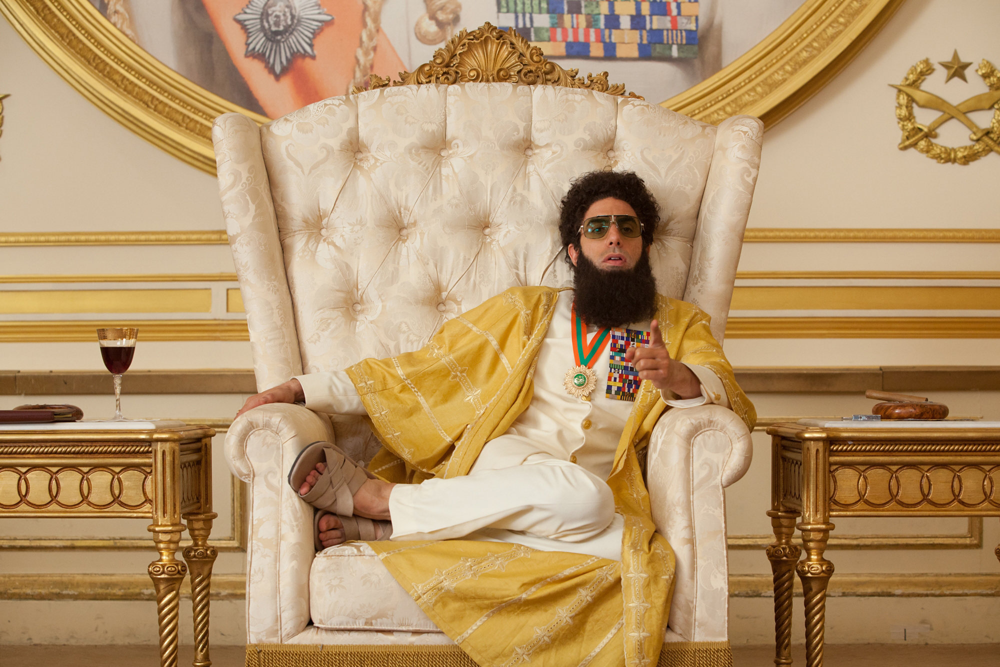

# 
## Usage
1. Fork (copy) this repository by clicking the "Fork" button on the top right corner.
2. Go to "Settings" -> "Pages" in your forked repository. Under "Branch" change "None" to "master" and click "Save".
3. Edit the `_config.yml` file in your forked repository to change the site title (after `title:`) and description (after `description:`).
4. Build your own page by editing this `README.md` (home page) and creating new `.md` files (other pages), formatting is done with standard [GitHub Markdown syntax](https://docs.github.com/en/get-started/writing-on-github/getting-started-with-writing-and-formatting-on-github/basic-writing-and-formatting-syntax), we provide an example file `example.md` in the repository.
**Important**: Please include ```--- layout: default ---``` (the first three line in `example.md`) at the beginning of your every newly created `.md` file.
5. Add your new `.md` files to the site by editing the `_config.yml` file in your forked repository. Under `navigation:` add a new pair of `- title:` and `url:`, and fill their value with your page name and `.md` file name. Remember to remove the `- title:` and `url:` pair for the example page.
6. Go back to "Settings" -> "Pages" to find your website link.


--------------------

# Lights, Camera, Action: Unraveling the Reel Impact of Real-World Events on Arab Representation in Movies

In the captivating realm of cinema, the silver screen not only reflects our collective imagination but also mirrors the complex tapestry of societal changes and historical events. One such moment that reverberated globally was the tragic day of September 11, 2001. Beyond its immediate and profound impact on geopolitics, security measures, and the psyche of nations, the events of 9/11 had a far-reaching influence on the cultural landscape, including the portrayal of Arab identities in the movies.

Our data analysis journey delves into the captivating intersection of reality and reel, seeking to understand how one of the most significant events of the 21st century shaped the representation of Arabs in cinema. The lens through which movies depict Arab characters, cultures, and narratives has often been subject to scrutiny, with questions raised about the perpetuation of stereotypes and the impact of real-world events on cinematic storytelling.

Through our analysis of the CMU movie dataset, spanning pre and post-9/11 eras, we hope to unearth patterns, trends, and anomalies that illuminate the multifaceted relationship between historical events and cinematic narratives. As we unravel the *reel impact of real-world events* (*tu-dums*), our journey promises to uncover not only the challenges but also the opportunities for more authentic storytelling in the world of cinema. So, grab your popcorn, and.... *Lights... Camera... Action!*

# *"Nice to meet you, I'm Data"*: getting familiar with the dataset



recycle P2, facts and graphs about initial pre-processings

# Wait a second... How do we detect arab characters?

Indeed, an important stepping stone for the analysis is to have a consensus on what do we mean by "Arab" character or location. 

*explain use of chatGPT word list, filtering + muslim VS arabic* --> + matteo's branch 


# [...] the crime and war genre

A first question we can ask is how did the participation of Arab characters in the crime and war (c&w) genre change after 2001, if it changed? This analysis can be made without the use of a movie's plot so it is a great place to start at. We are now able to detect movies with arab characters in our dataset. The selected years for the two groups formed need to exclude other non-negligible real-world events. We thus limit the analysis to movies from 1972 to 2013. Let's see if some trends can be spotted immediately by plotting simple statistics at first!

< Percentage of characters (overall and arab) in Crime and War movies, per year > 
+ only western countries (nothing new)

- Considering all the characters (blue bars), We can see that there is no clear trend. After 2003 the value seems eventually to decrease, that means a decresing partecipation for characters in W&C movies.

- Arabs (red bars) show a lot of fluctuations during the years, evidently during the last century. This is due to the small partecipation in W&C (less than 5 per year before 2003), generating less reliable percentages. After 2004 arab characters seems to play a higher fraction of these genre films than the overall characters in terms of mean values. Still the uncertainty given by bootstrapping shows that this can be stated only for years 2006, 2011 and 2012, where the confidence intervals do not intersect.

We can be more precise on this analysis looking at the feature before and after 2001. This grouping is done to avoid the problem of sparsity of data for arabs, specially doring the last century movies, that leads to high uncertainty. We will use an observational study scheme, with the treatment as the pubblication after 2001 and the outcome as the fraction of arab characters in W&C movies. First of all, we want to if the all characters trend is really negative for war and crime movies, confirming that this is not the reason for the possible positive correlalation for arabs.

< present OLS results >  + western filter

< present observationnal study results > + western filter

To conclude this analysis, we can say that there is a significant increase in participation of arab characters in w&c movies, [intensified when accounting only for western countries NOT SIGNIFICANT CF BAR PLOT], which intuitively, makes sense. But this result does not consider the possible positive / negative connotations in the movie. In the following parts, we delve in this more nuanced analysis.

# [...]  implicit connotations in movie plots

use P2's word clouds + LDA for topic modeling


# Sentiment analysis


