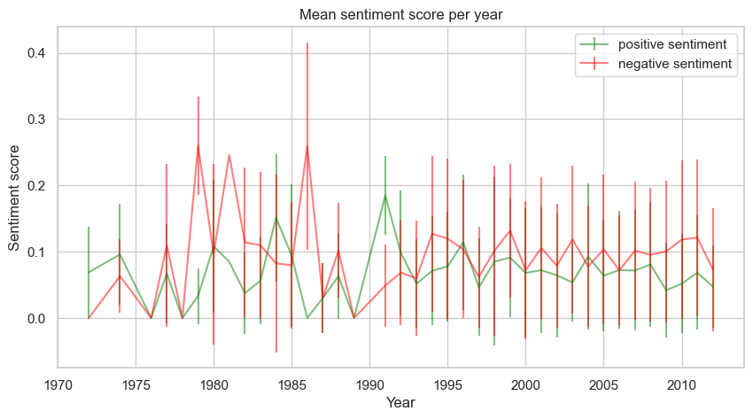
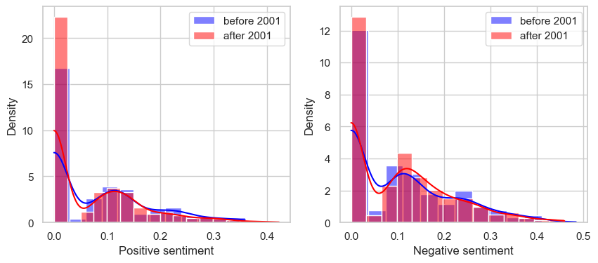
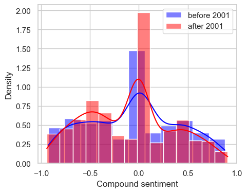

# 
## Usage
1. Fork (copy) this repository by clicking the "Fork" button on the top right corner.
2. Go to "Settings" -> "Pages" in your forked repository. Under "Branch" change "None" to "master" and click "Save".
3. Edit the `_config.yml` file in your forked repository to change the site title (after `title:`) and description (after `description:`).
4. Build your own page by editing this `README.md` (home page) and creating new `.md` files (other pages), formatting is done with standard [GitHub Markdown syntax](https://docs.github.com/en/get-started/writing-on-github/getting-started-with-writing-and-formatting-on-github/basic-writing-and-formatting-syntax), we provide an example file `example.md` in the repository.
**Important**: Please include ```--- layout: default ---``` (the first three line in `example.md`) at the beginning of your every newly created `.md` file.
5. Add your new `.md` files to the site by editing the `_config.yml` file in your forked repository. Under `navigation:` add a new pair of `- title:` and `url:`, and fill their value with your page name and `.md` file name. Remember to remove the `- title:` and `url:` pair for the example page.
6. Go back to "Settings" -> "Pages" to find your website link.


--------------------

# Lights, Camera, Action: Unraveling the Reel Impact of Real-World Events on Arab Representation in Movies

In the captivating realm of cinema, the silver screen not only reflects our collective imagination but also mirrors the complex tapestry of societal changes and historical events. One such moment that reverberated globally was the tragic day of September 11, 2001. Beyond its immediate and profound impact on geopolitics, security measures, and the psyche of nations, the events of 9/11 had a far-reaching influence on the cultural landscape, including the portrayal of Arab identities in the movies.

Our data analysis journey delves into the captivating intersection of reality and reel, seeking to understand how one of the most significant events of the 21st century shaped the representation of Arabs in cinema. The lens through which movies depict Arab characters, cultures, and narratives has often been subject to scrutiny, with questions raised about the perpetuation of stereotypes and the impact of real-world events on cinematic storytelling.

Through our analysis of the CMU movie dataset, spanning pre and post-9/11 eras, we hope to unearth patterns, trends, and anomalies that illuminate the multifaceted relationship between historical events and cinematic narratives. As we unravel the *reel impact of real-world events* (*tu-dums*), our journey promises to uncover not only the challenges but also the opportunities for more authentic storytelling in the world of cinema. So, grab your popcorn, and.... *Lights... Camera... Action!*

# *"Nice to meet you, I'm Data"*: getting familiar with the dataset


recycle P2, facts and graphs about initial pre-processings

# Wait a second... How do we detect arab characters?

Indeed, an important stepping stone for the analysis is to have a consensus on what do we mean by "Arab" character or location. 

*explain use of chatGPT word list, filtering + muslim VS arabic* --> + matteo's branch 


# [...] the crime and war genre

A first question we can ask is how did the participation of Arab characters in the crime and war (c&w) genre change after 2001, if it changed? This analysis can be made without the use of a movie's plot so it is a great place to start at. We are now able to detect movies with arab characters in our dataset. The selected years for the two groups formed need to exclude other non-negligible real-world events. We thus limit the analysis to movies from 1972 to 2013. Let's see if some trends can be spotted immediately by plotting simple statistics at first!

< Percentage of characters (overall and arab) in Crime and War movies, per year > 
+ only western countries (nothing new)

- Considering all the characters (blue bars), We can see that there is no clear trend. After 2003 the value seems eventually to decrease, that means a decresing partecipation for characters in W&C movies.

- Arabs (red bars) show a lot of fluctuations during the years, evidently during the last century. This is due to the small partecipation in W&C (less than 5 per year before 2003), generating less reliable percentages. After 2004 arab characters seems to play a higher fraction of these genre films than the overall characters in terms of mean values. Still the uncertainty given by bootstrapping shows that this can be stated only for years 2006, 2011 and 2012, where the confidence intervals do not intersect.

We can be more precise on this analysis looking at the feature before and after 2001. This grouping is done to avoid the problem of sparsity of data for arabs, specially doring the last century movies, that leads to high uncertainty. We will use an observational study scheme, with the treatment as the pubblication after 2001 and the outcome as the fraction of arab characters in W&C movies. First of all, we want to if the all characters trend is really negative for war and crime movies, confirming that this is not the reason for the possible positive correlalation for arabs.

< present OLS results >  + western filter

< present observationnal study results > + western filter

To conclude this analysis, we can say that there is a significant increase in participation of arab characters in w&c movies, [intensified when accounting only for western countries NOT SIGNIFICANT CF BAR PLOT], which intuitively, makes sense. But this result does not consider the possible positive / negative connotations in the movie. In the following parts, we delve in this more nuanced analysis.

# [...]  implicit connotations in movie plots

use P2's word clouds + LDA for topic modeling


# Sentiment analysis
Let's now dive into the core of our study: sentiment analysis. Sentiment analysis is the process of analyzing digital text to determine if the emotional tone of the message is positive, negative, or neutral. Our objective here is to understand if there is a significant change of sentiment towards arabic characters when depicted in US and Europe movies (i.e. "Western countries"). 

As we want to be sure that the sentiment analysis we perform is correctly related to the arabic characters, we perform this analysis on a range of `n` words before and after the target name (local contexts). 
As an example, let's consider the movie "House party 2" (1991). Here's an extract of the movie summary, highlighting the detected arabic character.

_"Kid and Play get into a fight and **Bilal** then convinces Kid to ask Sydney for money. Kid tries to approache Sydney but Sydney assumes that he wants to break up with her."_

For example, if `n = 5`, the following chunk of plot summary will be considered as the context around the arabic name _Bilal_.

_"Play get into a fight and **Bilal** then convinces Kid to ask Sydney"_

To determine the optimal context window size for sentiment analysis, we conducted a manual exploration of hyperparameters (hyperparameter tuning). This involved iteratively trying different sizes and examining example outputs to assess the impact on sentiment analysis results. By visually inspecting the sentiment context around Arabic names in sample plots, the most effective context window size was identified as `n = 9`. 

All of this said, let's have a look at the evolution of sentiment throughout the years.

To perform sentiment analysis and get sentiment polarity scores, VADER model is used. This model evaluates both polarity (positive/negative) and intensity (strength) of emotion of each word in a text. Then, it adds them up to obtain the sentiment score of the entire body. The model distinguishes 5 sentiment polarities:
- positive
- negative
- neutral
- compound

The compound score is the sum of positive, negative & neutral scores which is then normalized between -1 (most extreme negative) and +1 (most extreme positive).




The evolution year-by-year does not show us with a clear change of trend before and after 2001. The confidence intervals are almost always overlapped and not much can be stated even for the difference between positive and negative sentiment.

Let's now cumulate the sentiment scores of the range of years $[1972,2001]$ and $(2001,2012]$.  We can perform a t-test between the two distributions, respectively for compound, positive, and negative sentiment, obtaining the following results.

- The p-value for the compound sentiment scores is: 0.045
- The p-value for the positive sentiment scores is: 0.031
- The p-value for the negative sentiment scores is: 0.56

These results mean that there is a significant difference between the compound and positive sentiment distribution with a significance level of $\alpha = 0.05$. We can thus look into the distributions.

<div style="text-align:center">
  
</div>

<div style="text-align: center;">
  
</div>


As it is visible from these plots, positive sentiment scores after the year 2001 are consistently below the correspondat before 2001. On the other hand, negative sentiment scores after 2001 are consistently higher than before 2001 (even though this difference cannot be considered significant from the t-test result). The compound plot summarizes these results, as it is clear how a negative compound score (negative sentiment) is dominated by "after 2001" and a positive compound score (positive sentiment) is dominated by "before 2001".

Let's now visualize the most common words for the local contexts around arabic characters, via a wordcloud representation.

<div style="text-align:center">
  
</div>


It is interesting to notice how some semantically negative words increase theire frequency after 2001 (kill, bomb). However, it is difficult to actually appreaciate a big difference between the two situations with such a representation.

