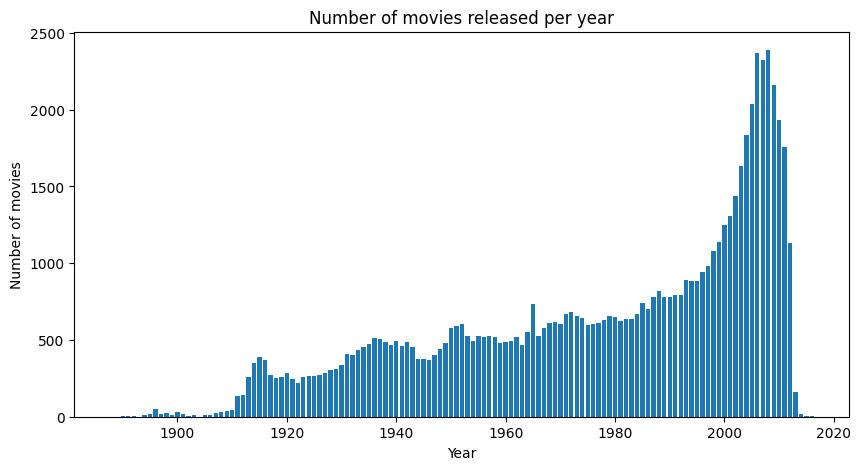
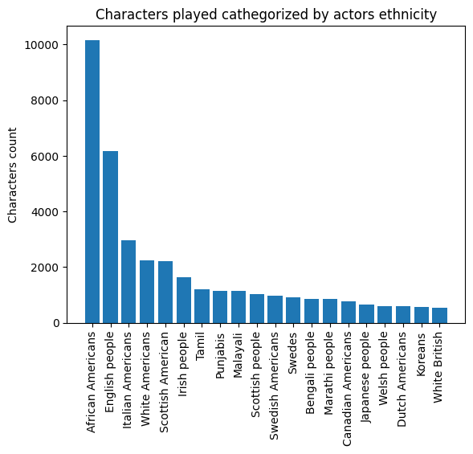
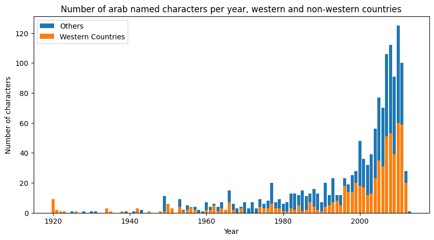
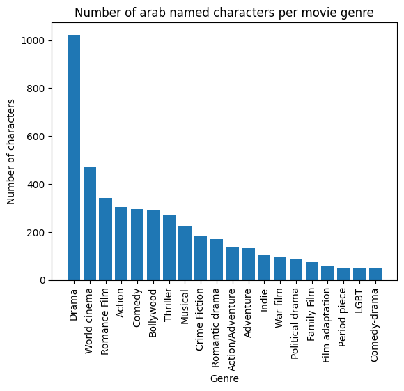

The dataset, available at [this link](http://www.cs.cmu.edu/~ark/personas/), is an open-source library of 42,306 movie plot summaries extracted from Wikipedia, aligned metadata extracted from Freebase, including
- Movie box office revenue, genre, release date, runtime, and language
- Character names and aligned information about the actors who portray them, including gender and estimated age at the time of the movie's release

Here are some visualizations resulting from preprocessing relevant for our study:

The increase in the number of movies is constant over the years, but there is an acceleration during and after the 90s. At a first glance, we concluded that any analysis between groups of movies before versus after 2001 would have fairly equal numbers: the 2001-2011 period is shorter but has more movies, compensating for possibly longer periods of time in the pre-2001 group.  
Some of our preliminary analysis consisted of exploring the ethnicities of actors in the dataset to assess the feasibility of our project. This is chosen as a first easily accessible indicator (through actor ethnicity code) of the distribution of character ethnicities in different countries. For this stage we are considering a correspondance between actor ethnicity and character ethnicity, as a symplifying hypothesis.

We then focused on Arab characters detected through the metodology described in the dedicated section of the main page. We looked how many characters per publishing country there are.

This figure is initially surprising: most Arab characters appear in Indian productions. This may be explained by the sheer amount of movies produced in Bollywood itself. In any case, when grouping by "western productions" and "all productions", Indian movies form the biggest counterweight to western movies.  
As we divided country of production in these two groups ("Western countries" + "Others"), we can show the number of characters per year.

The proportion between western and non-western countries is more or less consinstent through the years. From the number of arab-named characters per year represented in the figure above, we concluded that our project was feasible, as the sample was large enough for meaningful analysis in time.  
Another interesting exploratory step is showing the distribution of Arab characters in the different movie genres.

From the bar plot above we can see a clear dominance of the Drama genre, as expected as it is the most general one. Also, we detect a non-negligible presence of Arab characters in crime-fiction and war genres, making it possible to conduct further analysis on their evolution in time. It is now time to go back to the [home page](https://alexei-erm.github.io) to get into the meat of subject...

