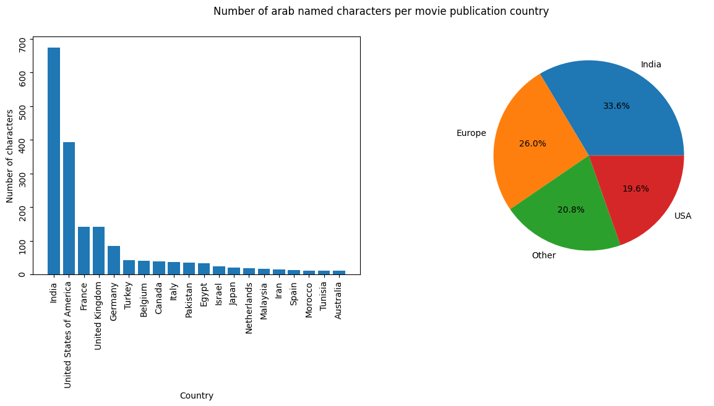

The dataset, available at [this link](http://www.cs.cmu.edu/~ark/personas/), is an open-source library of 42,306 movie plot summaries extracted from Wikipedia, aligned metadata extracted from Freebase, including
- Movie box office revenue, genre, release date, runtime, and language
- Character names and aligned information about the actors who portray them, including gender and estimated age at the time of the movie's release

Here are some interesting visualizations:

The increase in the number of movies is constant over the years, but there is an acceleration during and after the 90s. At a first glance, we concluded that any analysis between groups of movies before versus after 2001 would have fairly equal numbers: the 2001-2011 period is shorter but has more movies, compensating for possibly longer periods of time in the pre-2001 group.
Some of our preliminary analysis consisted of exploring the ethnicities of actors and characters in the dataset to assess the feasibility of our project:

As can be seen in the figure above, which is initially surprising, most arab characters appear in Indian productions. This may be explained by the sheer amount of movies produced in Bollywood itself. In any case, when grouping by "western" productions and "all productions", Indian movies form the biggest counterweight to western movies. 

From the number of arab-named characters per year represented in the figure above, we concluded that our project was feasible, as the sample was not small enough to be negligible and large enough for meaningful analysis.

Of course, it couldn't be *that* easy! No real trend can be seen in the genres above, and even less any positive/negative connotation. More advanced tools are needed to find meaningdul results, and that is why we believe this project is very interesting! It is now time to go back to the [home page](alexei-erm.github.io) to get into the meat of subject...

